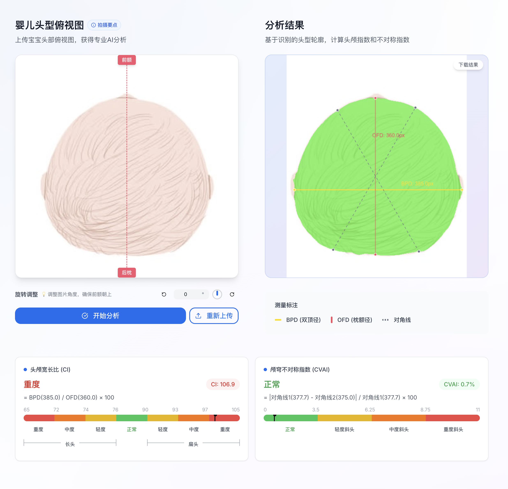

# 小月颅

> 一个基于深度学习的婴儿头型评估工具。我们自行训练的模型可从照片中提取头颅轮廓，并计算 CI 与 CVAI 指数，以辅助早期筛查。
> 项目同时提供了来自权威研究的循证教育资料库。旨在为父母提供可靠的见解，帮助缓解焦虑。

🌐 **在线体验**: [https://head.melolib.com](https://head.melolib.com)  
🤖 **模型训练仓库**: [https://github.com/voyax/lunasphere-segmentation](https://github.com/voyax/lunasphere-segmentation)

📖 **Language**: 中文 | [English](README.md)




## 🚀 核心功能

### AI 头型分析
- **本地处理**：模型推理直接运行在本地，不依赖于服务端
- **隐私保护**：无需上传照片 - 所有处理都在本地完成
- **测量工具**：自动计算头型指数（CI、CVAI）
- **可视化反馈**：清晰的视觉指示和测量结果

### 头型知识科普
- **科学信息**：基于循证医学的正常头型发育内容
- **常见问题**：关于头型最常被讨论的问题
- **发育指南**：头型变化过程的可视化展示
- **护理建议**：日常体位和睡眠的实用建议

## ✨ 平台特色

- 移动端优先设计
- 通用无障碍性
- 多语言支持
- 安全隐私保护

## 🚀 快速开始

### 环境要求

- Node.js 18+ 
- npm, yarn, 或 pnpm

### 安装步骤

```bash
# 克隆和设置
git clone https://github.com/voyax/lunasphere-web.git
cd lunasphere-web
npm install

# 启动开发服务器
npm run dev
```

打开 [http://localhost:3000](http://localhost:3000) 查看应用程序。

## 🛠️ 技术栈

- Next.js 14
- TypeScript
- HeroUI
- Tailwind CSS
- ONNX Runtime
- Framer Motion

## 📁 项目结构

```
app/          # Next.js 页面和布局
components/   # 可复用 UI 组件
lib/          # 工具函数和 AI 模型
public/       # 静态资源和模型文件
deployment/   # Docker 配置
```

## 🚀 部署

```bash
# Docker 部署
./deployment/build.sh v1.0.0
cd deployment && docker-compose up -d
```

详细部署说明请参见 [deployment/README.md](deployment/README.md)。

## 🤝 贡献

欢迎贡献！请阅读我们的[贡献指南](CONTRIBUTING.md)。

**开发指南：**
- 遵循 React 最佳实践和 TypeScript 标准
- 确保无障碍合规性（WCAG 2.1 AA）
- 保持医疗内容的准确性并提供适当引用

## 📄 许可证

本项目采用 GPL v3 许可证 - 详见 [LICENSE](LICENSE) 文件。

## 🔒 安全

如有安全问题，请查看我们的[安全政策](SECURITY.md)。


## ⚠️ 医疗免责声明

本平台仅用于教育目的，不应替代专业医疗建议。如有医疗问题，请务必咨询医疗专业人士。

---

**用 ❤️ 为婴儿健康教育而制作**