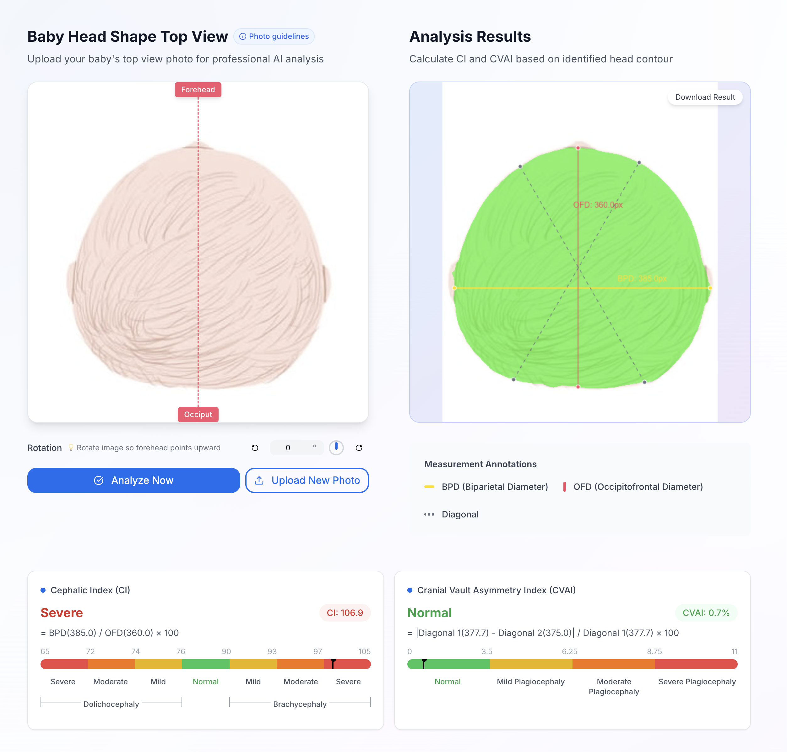

# LunaSphere

> A deep learning-based tool for assessing infant head shape. Our model extracts cranial contours from photos to compute CI & CVAI indices, aiding early screening.

> Includes evidence-based educational resources from authoritative research—helping parents gain insights and reduce anxiety.

🌐 **Live Demo**: [https://head.melolib.com](https://head.melolib.com)  
🤖 **Model Training**: [https://github.com/voyax/lunasphere-segmentation](https://github.com/voyax/lunasphere-segmentation)

📖 **Language**: [中文](README-zh.md) | English




## 🚀 Core Features

### AI Head Shape Analysis
- **Local Processing**：AI inference happens right in your browser
- **Privacy Protection**: No photos uploaded - all processing happens locally
- **Measurement Tools**: Automated calculation of head shape indices (CI, CVAI)
- **Visual Feedback**: Clear visual indicators and measurement results

### Head Shape Education
- **Scientific Information**: Evidence-based content about normal head shape development
- **FAQ Section**: Comprehensive answers to common parent questions
- **Development Guides**: Visual explanations of head shape changes over time
- **Care Tips**: Practical advice for daily positioning and sleep practices

## ✨ Platform Features

- Mobile-first design
- Universal accessibility
- Multi-language support
- Secure & private

## 🚀 Quick Start

### Prerequisites

- Node.js 18+ 
- npm, yarn, or pnpm

### Installation

```bash
# Clone and setup
git clone https://github.com/lunasphere-project/lunasphere-web.git
cd lunasphere-web
npm install

# Configure environment
cp .env.example .env.local

# Configure optional analytics (edit .env.local)
# UMAMI_WEBSITE_ID=your-website-id
# UMAMI_SCRIPT_URL=/path/to/your/script.js

# Start development
npm run dev
```

Open [http://localhost:3000](http://localhost:3000) to view the application.

## 🛠️ Tech Stack

- Next.js 14
- TypeScript
- HeroUI
- Tailwind CSS
- ONNX Runtime
- Framer Motion

## 📁 Structure

```
app/          # Next.js pages and layouts
components/   # Reusable UI components
lib/          # Utilities and AI models
public/       # Static assets and models
deployment/   # Docker configurations
```

## 🚀 Deployment

```bash
# Docker deployment
./deployment/build.sh v1.0.0
cd deployment && docker-compose up -d
```

See [deployment/README.md](deployment/README.md) for detailed instructions.

## 🤝 Contributing

Welcome contributions! Please read our [Contributing Guide](CONTRIBUTING.md).

**Development Guidelines:**
- Follow React best practices and TypeScript standards
- Ensure accessibility compliance (WCAG 2.1 AA)
- Maintain medical content accuracy with proper citations

## 📄 License

This project is licensed under the GPL v3 License - see the [LICENSE](LICENSE) file for details.

## 🔒 Security

For security issues, please see our [Security Policy](SECURITY.md).


## ⚠️ Medical Disclaimer

This platform is for educational purposes only and should not replace professional medical advice. Always consult healthcare professionals for medical concerns.

---

**Made with ❤️ for infant health education**
